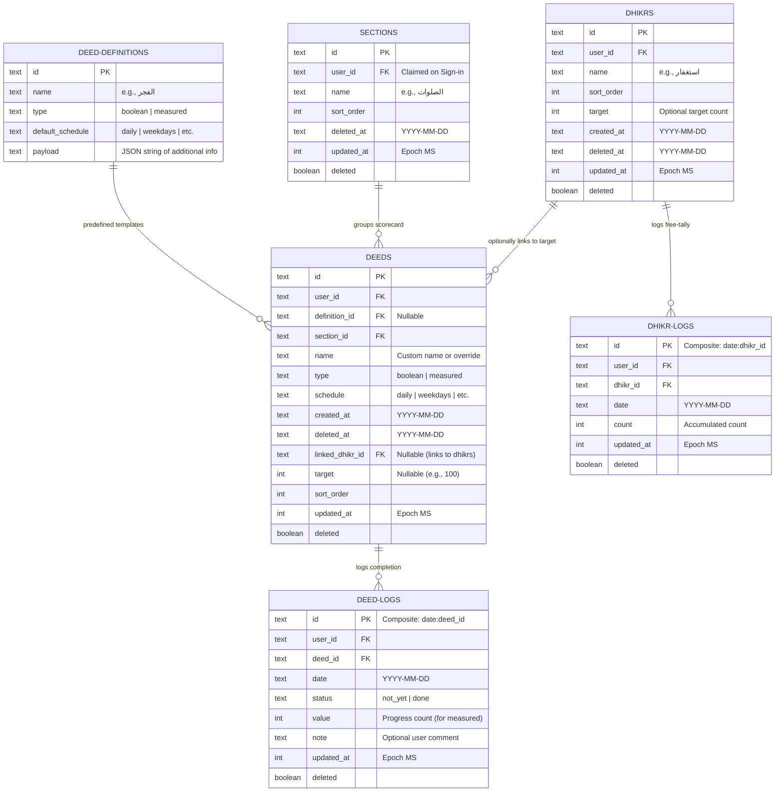

# Database ER Diagram (Generalized Deeds & Dhikr Mutlaq)

This document visualizes the database schema for the generalized scorecard and the separate Dhikr Mutlaq tables.

## 1. Visual Relationship (Mermaid)



---

## 2. ASCII ER Diagram

```text
    +-------------------+
    | deed_definitions  |
    +-------------------+
    | id (PK, text)     |
    | name (text)       |
    | type (text)       |
    | default_schedule  |
    | payload (text)    |
    +-------------------+
             |
             | 1
             |
             | 0..*
             v
    +-------------------+             +------------------+
    |       deeds       |------------>|     sections     |
    +-------------------+ 0..*      1 +------------------+
    | id (PK, text)     |             | id (PK, text)    |
    | user_id (text)    |             | user_id (text)   |
    | definition_id (FK)|             | name (text)      |
    | section_id (FK)   |             | sort_order (int) |
    | name (text)       |             | deleted_at (txt) |
    | type (text)       |             | updated_at (int) |
    | schedule (text)   |             | deleted (bool)   |
    | created_at (text) |             | dirty (bool)     |
    | sort_order (int)  |             +------------------+
    | deleted_at (text) |
    | linked_dhikr_id   |-------\     +------------------+
    | target (int)      |       |     |     dhikrs       |
    | updated_at (int)  |       |     +------------------+
    | deleted (bool)    |       |     | id (PK, text)    |
    | dirty (bool)      |       |     | user_id (text)   |
    +-------------------+       |     | name (text)      |
             |                  |     | sort_order (int) |
             | 1                |     | target (int)     |
             |                  |     | created_at (txt) |
             | 0..*             |     | deleted_at (txt) |
             v                  v 1   | updated_at (int) |
    +-------------------+   +-------+ | deleted (bool)   |
    |     deed_logs     |   |       | +------------------+
    +-------------------+   |       |          |
    | id (PK, text)     |   |       |          | 1
    | user_id (text)    |   | (ref) |          |
    | deed_id (FK)      |   |       |          | 0..*
    | date (text)       |   +-------+          v
    | status (text)     |             +-------------------+
    | value (int)       |             |    dhikr_logs     |
    | note (text)       |             +-------------------+
    | updated_at (int)  |             | id (PK, text)     |
    | deleted (bool)    |             | user_id (text)    |
    | dirty (bool)      |             | dhikr_id (FK)     |
    +-------------------+             | date (text)       |
                                      | count (int)       |
                                      | updated_at (int)  |
                                      | deleted (bool)    |
                                      | dirty (bool)      |
                                      +-------------------+
```

---

## 3. How the Auto-Completion Link Works

When the user increments their tally for a specific Dhikr in the **الأذكار المطلقة** view:
1. A write is made to `dhikr_logs` (e.g. `count = 150` for `dhikrId = 'istighfar_id'`, `date = '2026-06-12'`).
2. We query the `deeds` table for any active deeds where `linked_dhikr_id = 'istighfar_id'` and `target` is defined (e.g. `target = 100`).
3. For each matching deed, we check if `dhikr_log.count >= deed.target` (e.g., $150 \ge 100$).
4. If yes, we automatically update the `deed_logs` entry for that `deed_id` on that date to `status = 'done'` (and write/mark it as `dirty` for synchronization).
